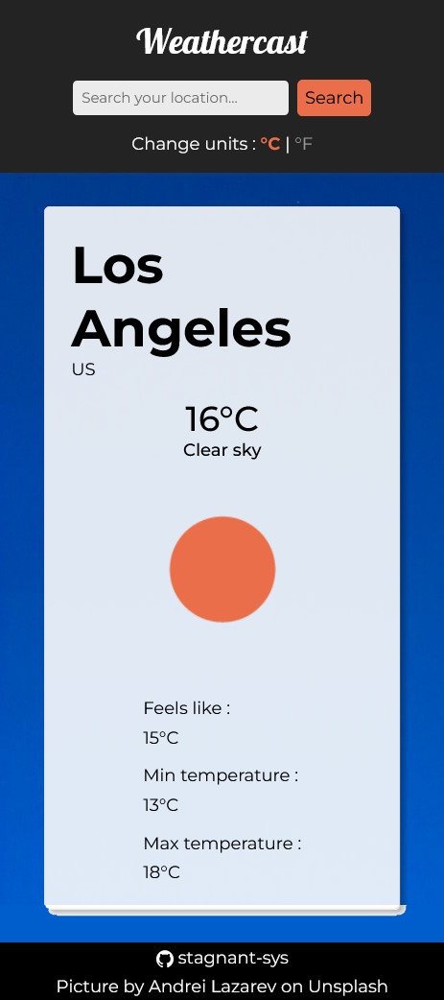

# Weathercast

## Weather web app

 

### Goals

This website was created during The Odin Project curriculum.

### Developed with

- Vanilla JavaScript ;
- OpenWeatherMap free API ;
- HTML ;
- CSS (with SCSS) ;
- Webpack.

### To do :
  - footer (photo credits)
  - add date/time
  - suggested clothing
  - citations about weather